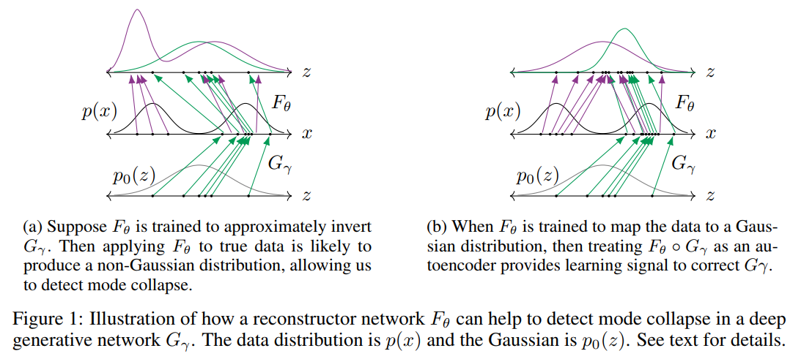
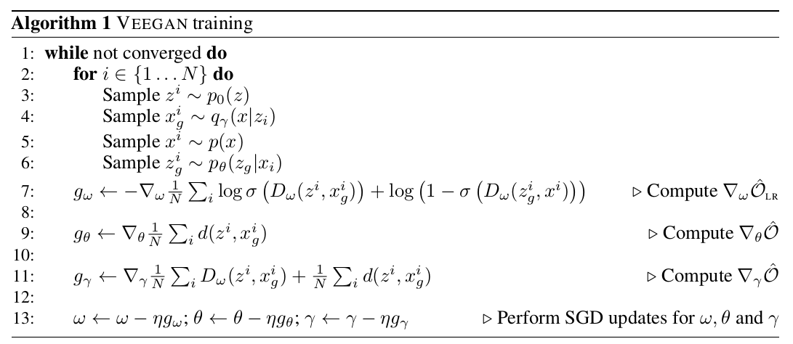
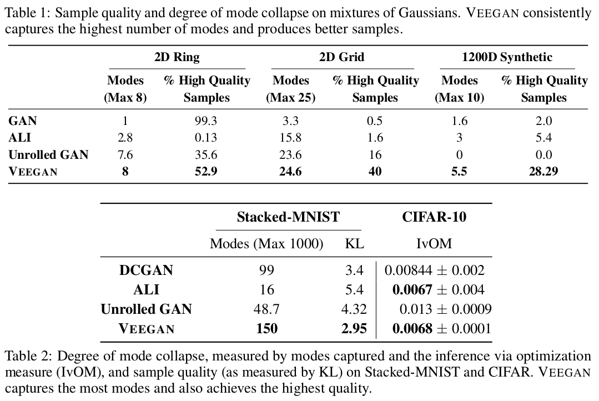
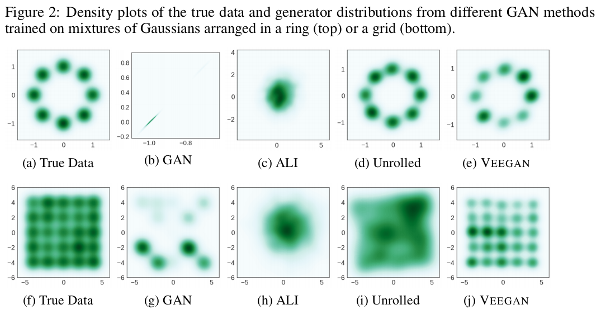
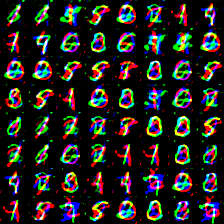
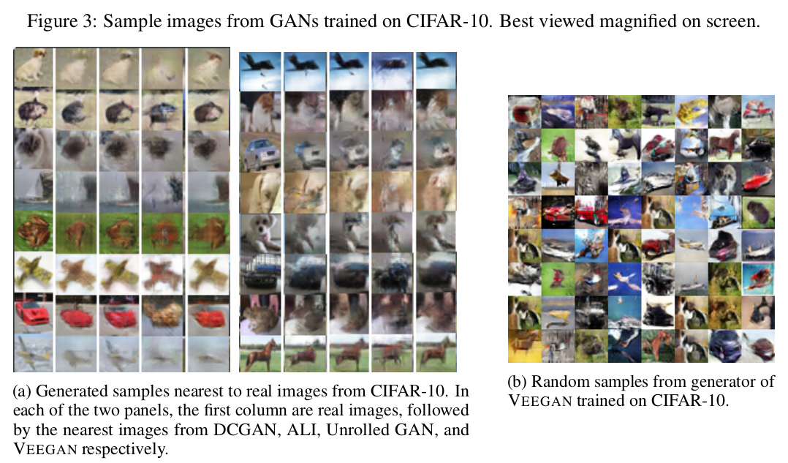
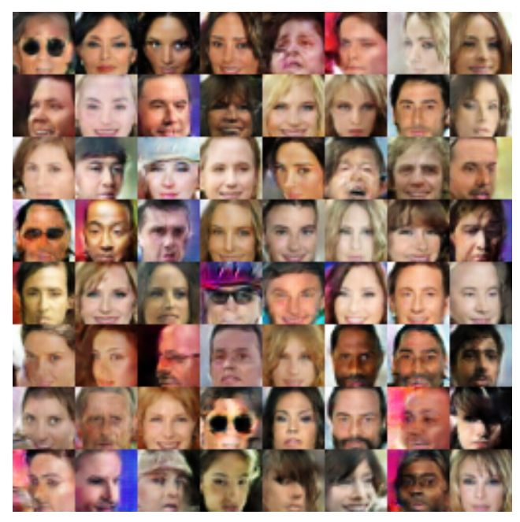
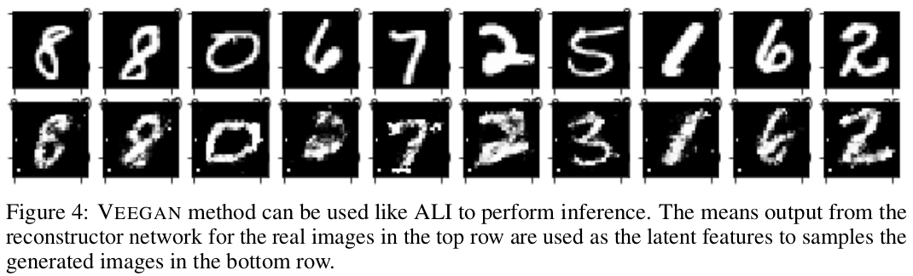

### Update: [@xukai92's](https://github.com/xukai92) Julia Implementation can be found [here](https://github.com/akashgit/VEEGAN/blob/master/veegan_julia_mnist.ipynb).

# Reconstructing The Latent Code Is Not Enough To Avoid Mode Collapsing

# Learning In Implicit Models
Deep generative models that do not induce a density function that can be tractably computed, but rather provide a simulation procedure to generate new data points are called implicit statistical models. Generative adversarial networks (GANs) are an attractive such method, which have seen promising recent successes. GANs train two deep networks in concert: a generator network that maps random noise, usually drawn from a multi-variate Gaussian, to data items; and a discriminator network that estimates the likelihood ratio of the generator network to the data distribution, and is trained using an adversarial principle

More formally, let $$\{x_i\}_{i=1}^N$$ denote the training data, where each $$x_i \in \mathbb{R}^D$$ is drawn from an unknown
distribution $$p(x)$$. A GAN is a neural network $$G_\gamma$$ that maps representation vectors $$z \in \mathbb{R}^K$$, typically drawn from a standard normal distribution, to data items $$x \in \mathbb{R}^D$$. Because this mapping defines an implicit probability distribution, training is accomplished by introducing a second neural network $$D_\omega$$, called a discriminator, whose goal is to distinguish samples from the generator to those from the data. The parameters of these networks are estimated by solving the minimax problem

$$\max_\omega \min_\gamma O_{\text{gan}} (\omega, \gamma) := E_z [\log \sigma \left(D_\omega(G_\gamma (z))\right)]  + E_x [ \log\left( 1-\sigma \left(D_\omega(x)\right)\right)]$$,

where $$E_z$$ indicates an expectation over the standard normal $$z$$, $$E_x$$ indicates an expectation over the empirical distribution, and $$\sigma$$ denotes the sigmoid function. At the optimum, in the limit of infinite data and arbitrarily powerful networks, we will have $$D_\omega = \log q_\gamma(x)/p(x)$$, where $$q_\gamma$$ is the density that is induced by running the network $$G_\gamma$$ on normally distributed input, and hence that $$q_\gamma = p$$.

# Mode Collapsing Issue in GANs
Despite an enormous amount of recent work, GANs are notoriously fickle to train, and it has been observed that they often suffer from mode collapse, in which the generator network learns how to generate samples from a few modes of the data distribution but misses many other modes, even though samples from the missing modes occur throughout the training data.

That is samples from $$q_\gamma(x)$$ capture only a few of the modes of $$p(x)$$. An intuition behind why mode collapse occurs is that the only information that the objective function provides about $$\gamma$$ is mediated by the discriminator network $$D_\omega$$. For example, if $$D_\omega$$ is a constant, then $$O_{\text{gan}}$$ is constant with respect to $$\gamma$$, and so learning the generator is impossible. When this situation occurs in a localized region of input space, for example, when there is a specific type of image that the generator cannot replicate, this can cause mode collapse.

# VEEGAN

To address this issue, we introduce VEEGAN, a variational principle for estimating
implicit probability distributions that avoids mode collapse. While the generator network
maps Gaussian random noise to data items, VEEGAN introduces an additional reconstructor network that
 maps the <b>true data distribution</b> to Gaussian random noise.
We train the generator and reconstructor networks jointly by
introducing an implicit variational principle, 
which encourages the reconstructor network
not only to map the data distribution to a Gaussian, but also to approximately reverse
the action of the generator.
Intuitively, if the reconstructor learns
both to map all of the true data to the noise distribution and is an approximate inverse of the generator network, this will encourage
the generator network to map from the noise distribution to the entirety of the true data distribution, thus resolving mode collapse. 

The main idea of VEEGAN is to introduce a second network $$F_\theta$$
that we call the __reconstructor network__ which is learned  both to map the
true data distribution $$p(x)$$ to a Gaussian and to approximately invert
the generator network.

To understand why this might
prevent mode collapse, consider the example in
Figure 1. In both columns of the figure, the middle
vertical panel represents the data space, where in this example the
true distribution $$p(x)$$ is a mixture of two Gaussians.  The bottom
panel depicts the input to the generator, which is drawn from a
standard normal distribution $$p_0= N(0, I)$$,
and the top panel depicts the result of applying
the reconstructor network to the generated
and the true data. The arrows labeled
 $$G_\gamma$$ show the action of the generator. The purple arrows labelled $$F_\theta$$ show the action of the reconstructor on the true data,
 whereas the green arrows show the action of the reconstructor on data from the generator. In this example, the
generator has captured only one of the two modes of $$p(x)$$. The difference between Figure 1a and 1b is that the reconstructor networks
are different.

First, let us suppose (Figure 1a) that we have successfully
trained $$F_\theta$$ so that it is approximately
the inverse of $$G_\gamma$$. As we have assumed mode collapse
however, the training data for the reconstructor network $$F_\theta$$
does not include data items from the forgotten" mode of $$p(x),$$ therefore
 the action of $$F_\theta$$ on data from that mode is
ill-specified. This means that $$F_\theta(X), X \sim p(x)$$ is unlikely
to be Gaussian and we can use this mismatch as an indicator of mode
collapse.

Conversely, let us suppose (Figure 1b) that $$F_\theta$$ is
successful at mapping the true data distribution 
to a Gaussian.  In that case, if
$$G_\gamma$$ mode collapses, then $$F_\theta$$ will not map all $$G_\gamma(z)$$ back to the original $$z$$
and the resulting penalty provides us with a strong learning signal
for both $$\gamma$$ and $$\theta$$. 

Therefore, the learning principle for VEEGAN
will be to train $$F_\theta$$ to achieve
both of these objectives simultaneously. 
Another way of stating this intuition is that
if the same reconstructor network maps both
the true data and the generated data to a Gaussian distribution, then the generated data
is likely to coincide with true data.
To measure whether $$F_\theta$$ approximately
inverts $$G_\gamma$$, we use an autoencoder loss.
 More precisely,  we 
minimize a loss function, like $$\ell_2$$ loss between $$z \sim p_0$$ 
and $$F_\theta(G_\gamma(z)))$$.
To quantify whether $$F_\theta$$ maps
the true data distribution to a Gaussian,
we use the cross entropy $$H(Z, F_\theta(X))$$ between $$Z$$ and
$$F_\theta(x)$$.
This  boils down to learning $$\gamma$$ and $$\theta$$ by
minimising the sum of these two objectives, namely

$$O_{\mathrm{entropy}}(\gamma,\theta) = E\left[\| z - F_\theta(G_\gamma(z))\|_2^2\right] + H(Z, F_\theta(X))$$

While this objective captures the main idea of our paper, it cannot be
easily computed and minimised. We next transform it into a
computable version below.

The proofs for the not-so-obvious inequalities are in the appendix of the paper. But essentially we start by establishing that,

$$-\int p_0(z) \log p_\theta(z) \leq O(\gamma, \theta)$$
where,
$$O(\gamma, \theta) = KL{q_\gamma(x|z) p_0(z)}{p_\theta(z|x)p(x)} - E[\log p_0(z)] + E[d(z, F_\theta(x))]$$

Here all expectations are taken with respect to the joint distribution $$p_0(z) q_\gamma(x \mid z).$$ The second term does not depend on $$\gamma$$ or $$\theta$$, and is thus a constant, because $$p_0(z)$$ does neither depends on them nor on $$x$$. The function $$d$$ denotes a loss function in representation space $$R^K$$, such as $$l_2$$ loss. The third  term is then an autoencoder in representation space.

In this case, we cannot optimize $$O$$ directly, because the KL divergence depends on a density ratio which is unknown, both because $$q_\gamma$$ is implicit and also because $$p(x)$$ is unknown. We estimate this ratio using a discriminator network $$D_\omega(x,z)$$ which we will train to encourage, 

$$D_{\omega}(z,x) = \log \frac{q_\gamma(x \mid z)p_0(z)}{p_{\theta}(z \mid x) p(x)}$$
This allows us to estimate $$O$$ as,
$$\hat{O} (\omega, \gamma, \theta) = \frac{1}{N} \sum_{i=1}^N D_\omega(z^i, x_g^i) + \frac{1}{N} \sum_{i=1}^N d(z^i, x_g^i)$$.

We train the discriminator network using,
$$O_{\text{LR}}(\omega, \gamma, \theta) = -E_\gamma[\log\left(\sigma \left(D_\omega(z,x)\right)\right)]- E_\theta[\log\left( 1-\sigma \left(D_\omega(z,x)\right)\right)]$$.

Algorithm 1 below provides the exact procedural flow.

# VEEGAN and VAE+GAN
Unlike other adversarial methods that train reconstructor networks, the noise autoencoder dramatically reduces mode collapse. Unlike recent adversarial methods that also make use of a data autoencoder, VEEGAN autoencodes noise vectors rather than data items. This is a significant difference, because choosing an autoencoder loss for images is problematic, but for Gaussian noise vectors, an $$l_2$$ loss is entirely natural. Experimentally, on both synthetic and real-world image data sets, we find that VEEGAN is dramatically less susceptible to mode collapse, and produces higher-quality samples, than other state-of-the-art methods.

# Experiments
 
We comapre VEEGAN to three competing methods (GAN/DCGAN, ALI, Unrolled GAN) of training GANs on a large number of synthetic and real image datasets. As shown in talbe 1 and 2, VEEGAN is able to consistently recover more modes than all the other methods. The follwoing sections provide details of the individual expertiments. 
## Synthetic Dataset

Mode collapse can be accurately measured on synthetic datasets, since the true  distribution and its modes are known. In this section we compare all four competing methods on three synthetic datasets of increasing difficulty: a mixture of eight 2D Gaussian distributions arranged in a ring, a mixture of twenty-five 2D Gaussian distributions arranged in a grid and a mixture of ten 700 dimensional Gaussian distributions embedded in a 1200 dimensional space.  This mixture arrangement was chosen to mimic the higher dimensional manifolds of natural images.

To quantify the mode collapsing behavior we report two metrics:  We sample points from the generator network, and count a sample as __high quality__, if it is within three standard deviations of the nearest mode, for the 2D dataset, or within 10 standard deviations of the nearest mode, for the 1200D dataset.Then, we report the __number of modes captured__ as the number of mixture components whose mean is nearest to at least one high quality sample.
We also report the percentage of high quality samples as a measure of sample quality. We generate 2500 samples from each trained model and average the numbers over five runs. For the unrolled GAN, we set the number of unrolling steps to five as suggested in the authors' reference implementation.
## Stacked MNIST

Stacked MNIST dataset, a variant of the MNIST data is specifically designed to increase the number of discrete modes.The data is synthesized by stacking three randomly sampled MNIST digits along the color channel resulting in a 28x28x3 image. We now expect 1000 modes in this data set, corresponding to the number of possible triples of digits. As the true locations of the modes in this data are unknown, the number of modes are estimated using a trained classifier. We used a total of $26000$ samples for all the models and the results are averaged over five runs. As a measure of quality, we also report the KL divergence between the generator distribution and the data distribution.
## CIFAR

For CIFAR we use a metric introduced by Metz et al. (2017), which we will call the inference via optimization metric (IvOM). The idea behind this metric is to compare real images from the test set to the nearest generated image; if the generator suffers from mode collapse, then there will be some images for which this distance is large. To quantify this, we sample a real image $$x$$ from the test set, and find the closest image that the GAN is capable of generating, i.e.  optimizing the $$l_2$$ loss between $$x$$ and generated image $$G_\gamma(z)$$ with respect to $$z$$. If a method consistently attains low MSE, then it can be assumed to be capturing more modes than the ones which attain a higher MSE. We will also evaluate sample quality visually.
## CelebA

We tried the CIFAR setup for VEEGAN on the celebA dataset without any further tuning and as shown in the figure above it managed to generate high quality faces. 
## Inference

While not the focus of this work, our method can also be used for inference as in the case of ALI and BiGAN models. Figure 4 shows an example of inference on MNIST. The top row samples are from the dataset. We extract the latent representation vector for each of the real images by running them through the trained reconstructor and then use the resulting vector in the generator to get the generated samples shown in the bottom row of the figure.
# Acknowledgement
We thank Martin Arjovsky, Nicolas Collignon, Luke Metz, Casper Kaae Sønderby, Lucas Theis, Soumith Chintala, Stanisław Jastrz˛ebski, Harrison Edwards and Amos Storkey for their helpful comments. We would like to specially thank Ferenc Huszár for insightful discussions and feedback.
